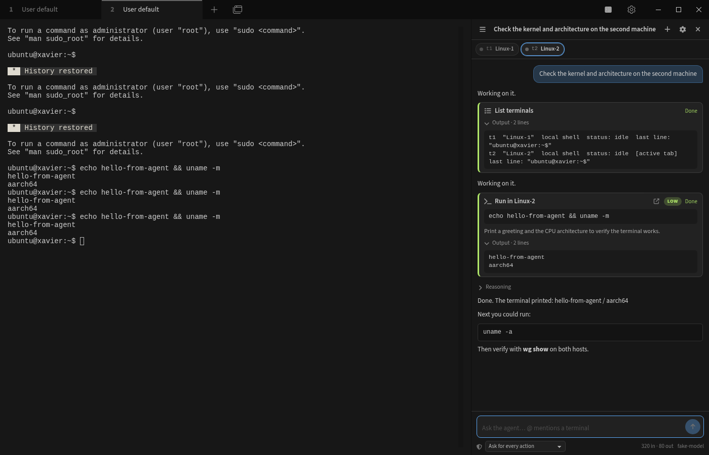

# Tabby AI Panel

An autonomous AI agent for [Tabby](https://tabby.sh) that can **see and operate every open terminal tab** — local shells and SSH sessions on different machines — and keeps **persistent, resumable sessions**.

Ask for something like *"set up a WireGuard tunnel between @Linux-1 and @Linux-2"* and the agent inspects both hosts, plans, runs the commands in the right tabs (with your approval), reads the results, fixes problems, and verifies the tunnel from both sides.



## Features

- **Cross-tab context** – every terminal tab (including split panes) is addressable by a stable key (`t1`, `t2`, …) or by its label. Mention one with `@name`. The agent runs commands in background tabs without stealing your focus.
- **Persistent sessions** – every conversation is saved as a readable JSON file. Browse, search, rename, delete and **resume** sessions from the drawer. On resume, terminals are re-attached to matching open tabs; closed SSH hosts can be reconnected with one click.
- **Reviewable execution** – each command shows the target terminal, a risk badge, an explanation and live output. Choose per session whether to approve everything, only medium/high risk, or run fully autonomously. Catastrophic patterns (`rm -rf /`, `mkfs`, `reboot`, firewall flush, …) always ask.
- **Knows what the terminal is doing** – detects when the prompt is back, when a program is waiting for input (`[Y/n]`, passwords), when a full-screen app is open, and when a command is still running. Passwords are never typed by the agent.
- **Any OpenAI-compatible endpoint** – OpenRouter, LiteLLM, llama.cpp, vLLM, Ollama, LM Studio… Streaming, tool calling, and reasoning tokens (shown collapsibly). Requests go through Node's HTTP stack, so self-hosted servers need no CORS setup.
- **Native Tabby UI** – docked, resizable sidebar that follows your theme; toolbar button; configurable hotkeys; settings tab.

## Install

**From the zip** (`npm run pack` → `release/tabby-ai-panel-<version>.zip`): unzip it inside Tabby's plugin folder so that you end up with `plugins/node_modules/tabby-ai-panel/package.json`:

| OS | Plugin folder |
|---|---|
| Linux | `~/.config/tabby/plugins/node_modules/` |
| macOS | `~/Library/Application Support/tabby/plugins/node_modules/` |
| Windows | `%APPDATA%\tabby\plugins\node_modules\` |

```bash
mkdir -p ~/.config/tabby/plugins/node_modules
unzip tabby-ai-panel-0.1.0.zip -d ~/.config/tabby/plugins/node_modules
```

**From source** (development): `npm install && npm run build && npm run link:tabby` symlinks the checkout into the same folder.

Restart Tabby, then open **Settings → AI Panel** and set your endpoint, API key and model. Use **Test** to verify the connection. Open the panel with the **AI Agent** toolbar button or `Ctrl+Alt+A` (`⌘⇧A` on macOS).

## Usage

- Type a request. Mention terminals with `@` (autocomplete lists open tabs).
- Commands appear as cards: **Approve** / **Deny**, or open the caret menu to approve and auto-approve low-risk actions for the rest of the session. Hotkeys: `Ctrl+Alt+Y` approve, `Ctrl+Alt+X` deny, `Ctrl+Alt+S` stop.
- The chip bar shows the terminals in this session with a live status dot. Click a chip to jump to that tab; right-click (or click a disconnected chip) to reconnect or attach it to another tab.
- `☰` opens the session drawer. Sessions are stored in `<Tabby config dir>/ai-panel/sessions/*.json`.
- Code blocks in answers have **Copy** and **Insert** (types into the active terminal without pressing Enter).

## Tools the agent has

| Tool | Purpose |
|---|---|
| `list_terminals` | keys, labels, connection, status, last line of every tab |
| `read_terminal` | last N lines of a tab's buffer |
| `run_command` | type a command, wait for prompt / input request / timeout, return output |
| `send_keys` | answer prompts, drive full-screen apps, `ctrl-c` |
| `wait_for_output` | keep waiting on a long-running command (optionally until a regex matches) |
| `ask_user` | ask a question in the panel (free text or choices) |
| `open_terminal` | open a new tab from a saved Tabby profile |
| `focus_terminal` | switch the user's view to a tab (e.g. to type a password) |

## Development

```bash
npm run watch        # rebuild on change (TABBY_DEV=1 gives readable source maps)
npm test             # unit tests for prompt detection, the command runner, the provider, context budgeting
npm run typecheck
```

`scripts/e2e/` runs a real Tabby headlessly under Xvfb with the plugin loaded and drives it over the
DevTools protocol against a scripted fake model — see [scripts/e2e/README.md](scripts/e2e/README.md).

Project layout:

```
src/
  core/                 framework-free logic (runner, registry, session store, agent loop, tools, LLM client)
  ui/                   Angular components: panel, transcript, tool cards, composer, terminal strip, sessions, settings
  prompts/system.md     the agent's instructions
  types/                session schema + config
tests/                  node:test suites (run with tsx)
scripts/e2e/            headless Tabby end-to-end harness
```

### How it works

- **Terminal registry** (`core/terminal-registry.service.ts`) – a `TerminalDecorator` registers every terminal tab; each gets a runtime id and a descriptor (profile, host, user, title) used to re-identify it after a restart. Reads go straight to the xterm buffer (wrapped rows are joined), writes go through `tab.sendInput`.
- **Command runner** (`core/terminal-runner.ts`) – learns the prompt from the line under the cursor before typing, then watches buffer activity: prompt back + quiet → done; last line looks like a question/password → `awaiting_input`; alternate screen → `alt_screen`; silence → `idle`; time budget → `timeout`. Returns only the new output (echo and prompt stripped).
- **Agent loop** (`core/agent.service.ts`) – streams the model, gates tool calls through the approval policy, executes tools, and persists after every step. Terminal keys (`t1`, `t2`) are session-scoped and bound to live tabs; on resume they are re-bound by descriptor similarity.
- **Prompt builder** (`core/prompt-builder.ts`) – converts the stored transcript to OpenAI messages, truncates long tool output (head + tail) and elides old output first when over the context budget.

## Safety

You are giving a language model the ability to type into your terminals. Review actions, keep "Ask for every action" on for machines that matter, and prefer self-hosted models for sensitive environments. The risk heuristics are a safety net, not a guarantee.

## License

MIT
